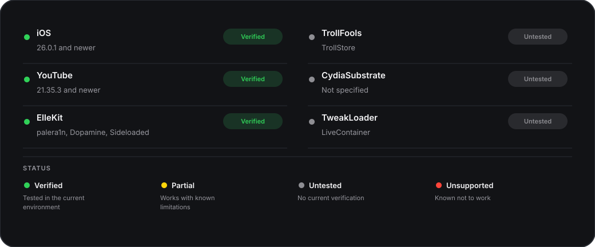

# DeArrow

[](https://github.com/castdrian/DeArrow/actions/workflows/release.yml)
[](https://github.com/castdrian/DeArrow/actions/workflows/build.yml)

YouTube tweak that brings community-submitted titles and thumbnails to YouTube for iOS.

<p align="center"></p>

## Download

<p>
  <a href="https://repo.adriancastro.dev"></a>
  &nbsp;
  <a href="https://github.com/castdrian/DeArrow/releases/latest"></a>
</p>

## Features

- Replace eligible titles with community-submitted DeArrow alternatives
- Replace eligible thumbnails through the dedicated DeArrow thumbnail service
- Apply branding across feeds, search, related videos, playlists, channel listings, playback, and Shorts
- Preserve YouTube branding when a response is unavailable, invalid, or stale
- Configure title and thumbnail behavior from a native YouTube settings page
- Support rootless ElleKit packages and sideloaded YouTube injection

## Compatibility



## Installation

Install the rootless package from a compatible package manager, or inject `DeArrow.dylib` into a sideloaded YouTube build. Restart YouTube after installation.

## Building

Install Theos, clone [YouTubeHeader](https://github.com/PoomSmart/YouTubeHeader) into `$THEOS/include/YouTubeHeader`, and run:

```sh
gmake package FINALPACKAGE=1
```

The package is written to `packages/`.

## Testing

Run the deterministic fixture suite with `go test ./...`. Run `go run ./scripts/branding-smoke` to validate the live DeArrow records used by the fixture matrix, including neutral long-form, penguinz0 commentary and bodycam videos, and a Shorts URL with no listing.


## Privacy and network behavior

DeArrow does not intercept YouTube networking or collect telemetry. It contacts the public DeArrow and SponsorBlock branding services by video ID, caches successful and negative responses, and silently keeps YouTube’s original title or thumbnail when a request fails.

## Attribution

This project is a maintained fork of [pixelomer/DeArrow-iOS](https://github.com/pixelomer/DeArrow-iOS). Community branding data is provided by [DeArrow](https://dearrow.ajay.app/) and [SponsorBlock](https://sponsor.ajay.app/).

## Contributors

[](https://github.com/castdrian/DeArrow/graphs/contributors)
